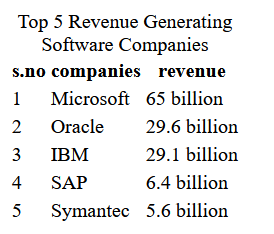

# EX01 Developing a Simple Webserver
## Date:03/10/2025

## AIM:
To develop a simple webserver to serve html pages and display the Device Specifications of your Laptop.

## DESIGN STEPS:
### Step 1: 
HTML content creation.

### Step 2:
Design of webserver workflow.

### Step 3:
Implementation using Python code.

### Step 4:
Import the necessary modules.

### Step 5:
Define a custom request handler.

### Step 6:
Start an HTTP server on a specific port.

### Step 7:
Run the Python script to serve web pages.

### Step 8:
Serve the HTML pages.

### Step 9:
Start the server script and check for errors.

### Step 10:
Open a browser and navigate to http://127.0.0.1:8000 (or the assigned port).

## PROGRAM:
```
from http.server import HTTPServer, BaseHTTPRequestHandler

content = """
<!DOCTYPE html>
<html>
<head>
    <title>Top 5 Revenue Generating Software Companies</title>
</head>
<body>
    <table>
        <caption>Top 5 Revenue Generating Software Companies</caption>
        <tr>
            <th>s.no</th>
            <th>companies</th>
            <th>revenue</th>
        </tr>
        <tr>
            <td>1</td>
            <td>Microsoft</td>
            <td>65 billion</td>
        </tr>
        <tr>
            <td>2</td>
            <td>Oracle</td>
            <td>29.6 billion</td>
        </tr>
        <tr>
            <td>3</td>
            <td>IBM</td>
            <td>29.1 billion</td>
        </tr>
        <tr>
            <td>4</td>
            <td>SAP</td>
            <td>6.4 billion</td>
        </tr>
        <tr>
            <td>5</td>
            <td>Symantec</td>
            <td>5.6 billion</td>
        </tr>
    </table>
</body>
</html>
"""

class MyHandler(BaseHTTPRequestHandler):
    def do_GET(self):
        print("Request received")
        self.send_response(200)
        self.send_header('Content-type', 'text/html; charset=utf-8')
        self.end_headers()
        self.wfile.write(content.encode())

server_address = ('', 8000)
httpd = HTTPServer(server_address, MyHandler)
print("My webserver is running...")
httpd.serve_forever()
```
## OUTPUT:



## RESULT:
The program for implementing simple webserver is executed successfully.
